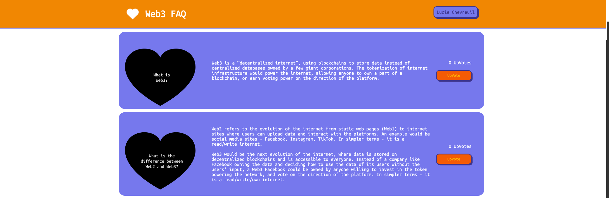

#  Web3 FAQ Custom Web Page
- *Completed with HTML, CSS and Javascript in ~1 hour*
- *Pages link to site: https://sasszz.github.io/web3FAQ/*

### Highlighted Functionality:
- Coded in pure HTML, CSS and Javascript without use of any libraries
- Buttons and Navigation Bar Links change color when hovered over
- Clicking "UpVote" button increases number of votes
- SVG Heart-shaped frame over FAQ images

### Screen Capture of Web Page:

  

